# F# Language - Railroad Diagrams

Generated from `fsharp_parser.pl` DCG rules.

## app_expr

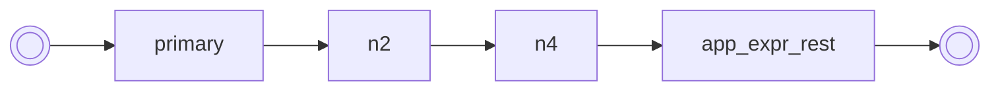

## app_expr_rest

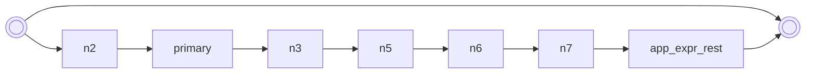

## arith_expr

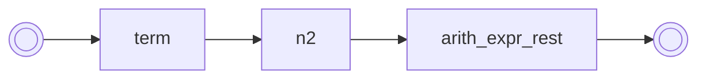

## arith_expr_rest

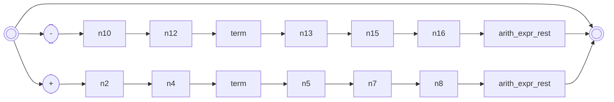

## binding

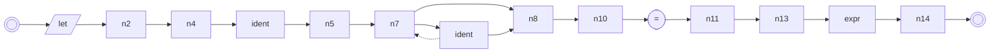

## expr

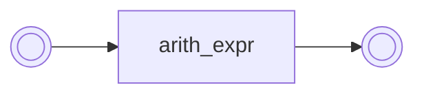

## factor

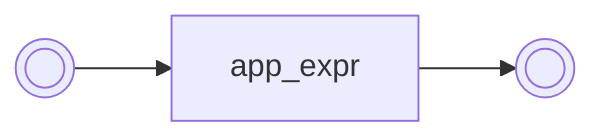

## primary

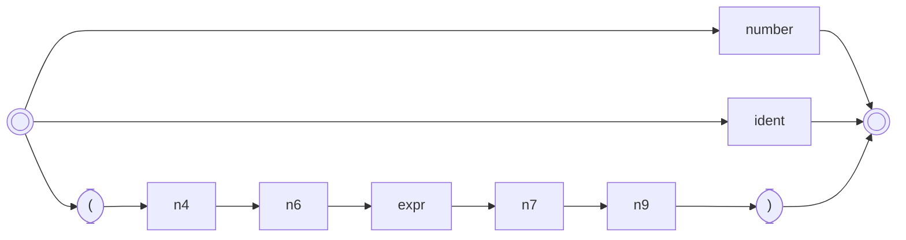

## program

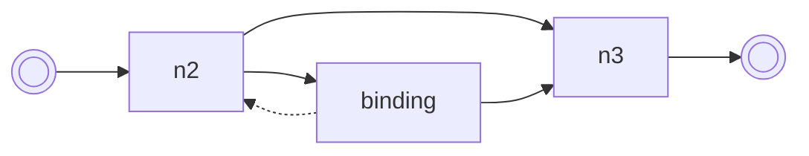

## term

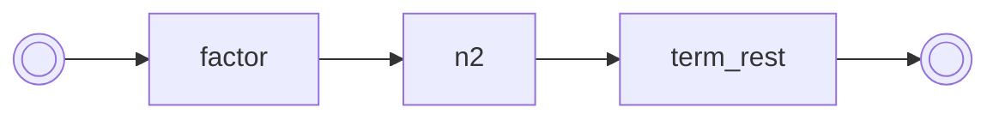

## term_rest

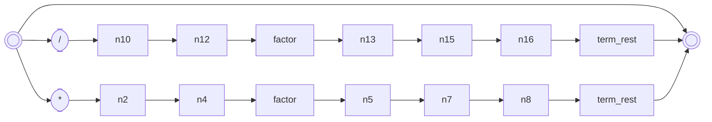

